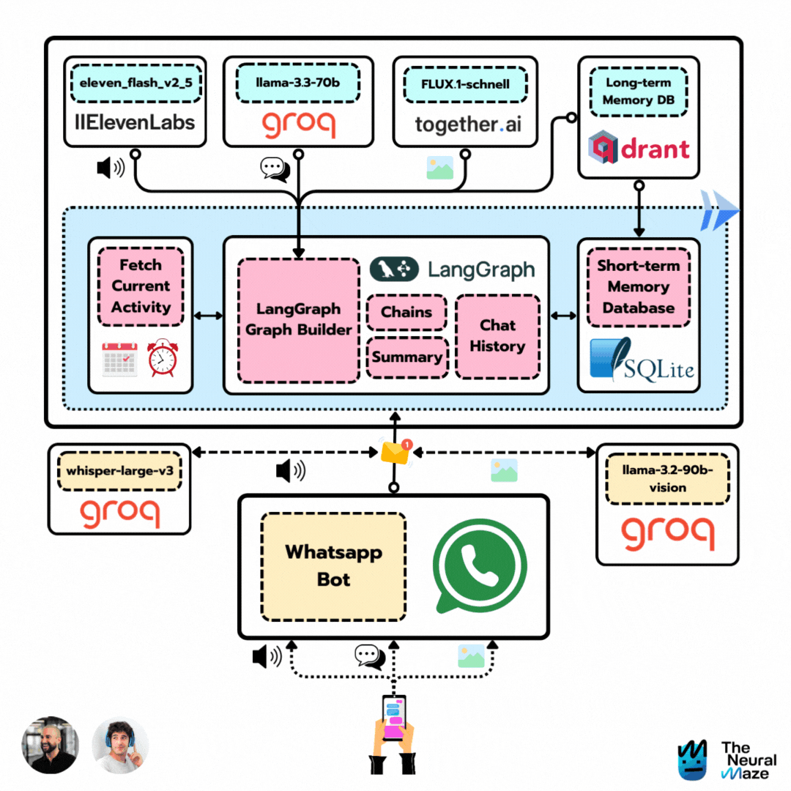

# AI Companion

**Author:** Vivek

This project is a multi-modal AI companion named Ava. It's designed to be an interactive and engaging conversational agent capable of handling text, images, and audio. The agent is built with a sophisticated graph-based workflow using LangGraph, allowing for complex and context-aware interactions.



## ✨ Features

- **Conversational AI:** Engage in natural and dynamic conversations.
- **Long-term Memory:** Remembers past interactions to provide a personalized experience.
- **Multi-modal Capabilities:**
    - **Image Generation:** Creates images from text descriptions.
    - **Image Understanding:** Can process and understand uploaded images.
    - **Speech-to-Text & Text-to-Speech:** Interacts via voice messages.
- **Context-Aware:** Injects relevant context into conversations for more meaningful responses.
- **Scheduled Context Injection:** Can proactively introduce topics or information based on a schedule.
- **Deployable on Multiple Platforms:** Comes with interfaces for both [Chainlit](https://chainlit.io/) and [WhatsApp](https://www.whatsapp.com/).
- **Dockerized:** Easy to set up and run using Docker.

## 🛠️ Tech Stack

- **Orchestration:** [LangGraph](https://python.langchain.com/docs/langgraph)
- **LLM Providers:** [Groq](https://groq.com/), [Together AI](https://www.together.ai/)
- **Frameworks:** [LangChain](https://www.langchain.com/), [FastAPI](https://fastapi.tiangolo.com/)
- **UI:** [Chainlit](https://chainlit.io/)
- **Vector Store:** [Qdrant](https://qdrant.tech/)
- **Text-to-Speech:** [ElevenLabs](https://elevenlabs.io/)
- **Containerization:** [Docker](https://www.docker.com/)

## 🚀 Getting Started

### Prerequisites

- [Docker](https://docs.docker.com/get-docker/) installed on your machine.
- API keys for the services you want to use (Groq, Together AI, ElevenLabs, etc.).

### Installation

1.  **Clone the repository:**
    ```bash
    git clone https://github.com/neural-maze/ava-whatsapp-agent-course.git
    cd ava-whatsapp-agent-course
    ```

2.  **Create a `.env` file:**
    Based on the `.env.example` file (if provided), create a `.env` file and add your API keys and other configuration values.

### Running the Application

This project uses a `Makefile` to simplify running the application.

-   **Build the Docker containers:**
    ```bash
    make ava-build
    ```

-   **Run the application in detached mode:**
    ```bash
    make ava-run
    ```

-   **Stop the application:**
    ```bash
    make ava-stop
    ```

-   **Clean up (deletes memory stores):**
    ```bash
    make ava-delete
    ```

## 📂 Project Structure

```
.
├── src/
│   └── ai_companion/
│       ├── core/         # Core logic, prompts, and schedules
│       ├── graph/        # LangGraph definition (nodes, edges, state)
│       ├── interfaces/   # Interfaces for Chainlit and WhatsApp
│       ├── modules/      # Modules for image, memory, speech, etc.
│       └── settings.py   # Project settings
├── Dockerfile
├── docker-compose.yml
├── Makefile
├── pyproject.toml      # Python project definition and dependencies
└── README.md
```

## 📄 License

This project is licensed under the MIT License. See the [LICENSE](LICENSE) file for details.
